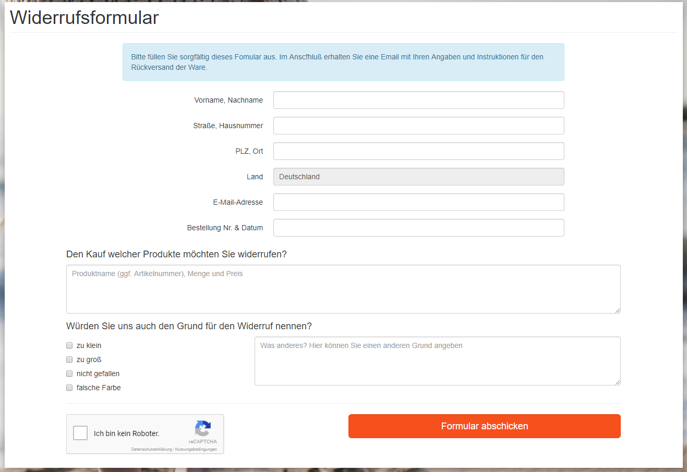
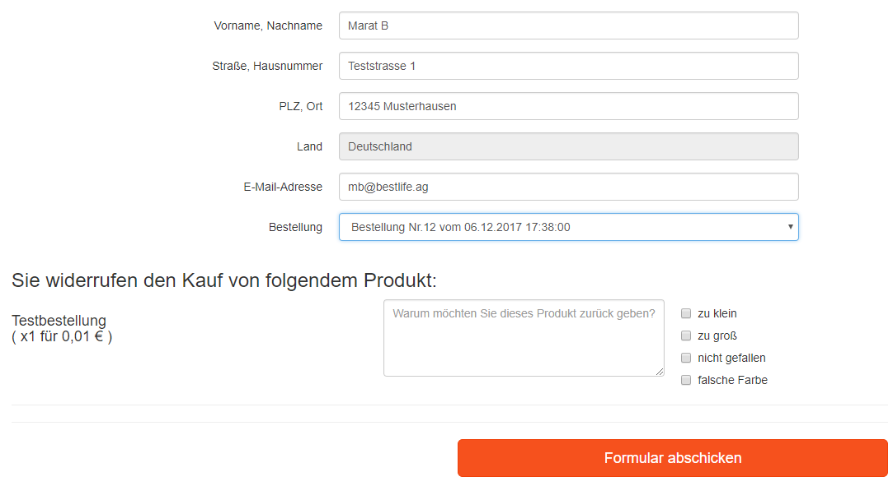

## das etwas intelligentere Widerrufsformular für OXID eShop v6.2+

## Funktionen:
- Google ReCaptcha für Schutz vor Spam/Missbrauch
- konfigurierbare Retoure-Gründe
- Das Formular wird per E-mail an den Kunden und an den Shopbetreiber verschickt
- Zusätzliche und abweichende Empfänger möglich
- Link zum externen Retoruenportal kann per E-Mail verschickt werden (z.B. DHL Portal für Erstellung der Versandaufkleber)
- Übernahme der Daten aus dem Profil + Übersicht der letzten Bestellungen für eingeloggte Kunden
#### Besucher ist nicht im Shop angemeldet:

#### Kunde ist im Shop angemeldet:

## Installation
- `composer require -n  vanilla-thunder/oxid-module-withdrawal-form`
- Datenschutzhinweise ergänzen
- Modul aktivieren
- Modul-Einstellungen vornehmen
- bei Bedarf SEO URL für *``index.php?cl=withdrawalform``* erstellen
- bei Bedarf eine CMS Seite mit dem Ident `withdrawalemailend` erstellen, diese wird im Email Footer eingefügt und soltle so ähnlich wie `oxemailfooter`  aufgebaut sein.

## reCaptcha & DSGVO
Der Knackpunkt ist: reCaptcha sammelt und analysiert Daten u.A. über das Gerät und das Verhalten im Browser, um normale Besucher von Bots zu unterscheiden.  
Somit muss reCaptcha in die Datenschutzbedingungen entsprechend erwähnt werden.
  
Die Einbindung von reCaptcha ohne ausdrücklicher Einwilligung wird mit DSGVO Artikel 6 Abschnitt 1 Buchstabe f begründet: 
die Verarbeitung ist rechtmäßig, weil sie zur Wahrung der berechtigten Interessen des Verantwortlichen erforderlich, nämlich um die Webseite vor Angriffen zu schützen und den möglichen Missbrauch der Kundendaten zu verhindern.  
(Vollständiger Text: https://dsgvo-gesetz.de/art-6-dsgvo/)

Hier sind zwei Beispiele für solch einen Datenschutz-Text (einfach auf der Seite nach "reCaptcha" suchen): 
+ https://www.it-recht-kanzlei.de/datenschutz.php 
+ https://www.cleverreach.com/de/funktionen/datenschutz-sicherheit/eu-dsgvo/

#### Falls jemand es ganz genau wissen möchte:
Das Modul setzt reCaptcha v2 ein und zwar nur auf der Seite mit dem Formular und nur dann, wenn der Besucher nicht als Shop-Kunde eingeloggt ist.
Somit werden die Daten nur dann gesammelt, wenn der Besucher das Formular aufruft (zum Vergleich: reCaptcha v3 sammelt die Daten immer und überall, wo es geht)

#### Wichtige Hinweise zum Modul:
+ Das Modul gibts nur auf Deutsch, so gut wie alle Texte und Überschriften sind direkt im Template eingefügt (sorry, ich war faul). Für Mehrsprachigkeit müssen also erst die deutschen Texte durch language keys ersetzt werden etc.
 
+ Für angemeldete Benutzer wird ihre Bestellhistorie geladen und zwar anhand der oxID des Benutzers **oder** der Email in der Rechnungsadresse. So könnten z.B. auch ehemalige Gastbesteller nach der Registrierung ihre vorherigen Gastbestellungen in der Historie sehen.   
Unter ganz komischen Umständen könnte dies aber auch dazu führen, dass man fremde Bestellungen sieht, wenn zwei Kunden ihre Email Adressen geändert haben und der zweite Kunde dann die Email Adresse des ersten Kunden bei sich einträgt. Aber das wäre dann echt Inception-Style und ohne Absprache kaum vorstellbar.

+ Bestelldatum und -status werden beim Laden der Bestellhistorie nicht berücksichtigt, d.h. es würden neue, unbezahlte, unverschickte oder auch ganz alte Bestellungen von vor 5 Jahren auftauchen. Je nach Geschäftsmodell müsste man das vielleicht anpassen.