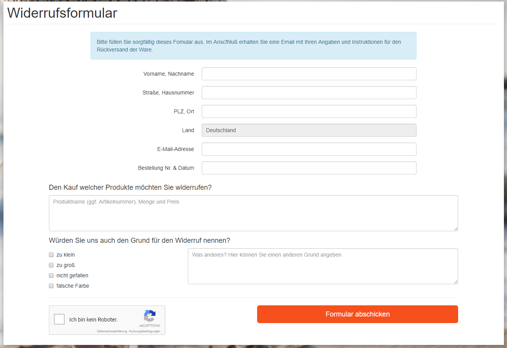
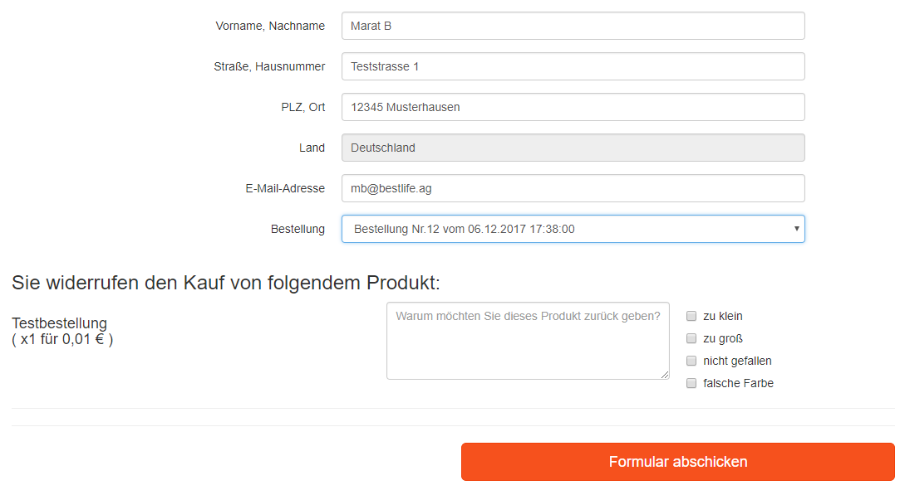

# Achtung!
Dieses Modul wurde vor DSGVO entwickelt und es fehlt die obligatorische Datenschutz-Checkbox.
Solltet ihr es dennoch irgendwo einsetzen wollen, müsst ihr die Änderungen aus der Version für OXID 6 manuell übernehmen.

## Widerrufsformular für OXID eShop
getestet mit OXID 4.10, sollte aber auch unter 4.9 laufen

## Funktionen:
- Google ReCaptcha
- konfigurierbare Retoure-Gründe
- Das Formular wird per E-mail an den Kunden und an den Shopbetreiber verschickt
- Link zum externen Retoruenportal kann per E-Mail verschickt werden (z.B. DHL Portal für Erstellung der Versandaufkleber)
- Übernahme der Daten aus dem Profil + Übersicht der letzten Bestellungen für eingeloggte Kunden

## Installation
- herutnerladen
- entpacken
- Inhalt von copy_this in den Shop hochladen
- Modul aktivieren
- In den Reiter "Einstellungen" wechseln und dort alles nötige eintragen
- bei Bedarf SEO URL für *``index.php?cl=withdrawalform``* erstellen
